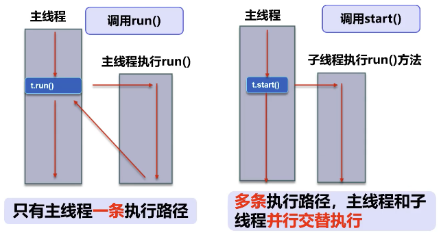

# 多线程 multithreading

## 线程简介

### 程序、进程、线程

- 程序
  - 指令和数据的有序集合，其本身没有任何运行的含义，是一个静态的概念。
- 进程
  - 执行程序的一次执行过程，是一个动态的概念。是系统资源分配的单位。
- 线程
  - 通常在一个进程中可以有若干个线程，一个进程至少有一个线程，否则就没有存在的意义。线程是CPU调度和执行的单位。

> 很多多线程是模拟出来的，真正的多线程是指有多个CPU，即多核，如服务器。如果是模拟出来的多线程，即在一个CPU的情况下，在同一个时间点，CPU只能执行一个代码，因为CPU切换得很快，所以有同时执行的错觉。

### 概念

- 线程就是独立的执行路径。
- 在程序运行时，即使没有自己创建线程，后台也会有多个线程，如主线程，GC线程。
- `main()` 方法称之为主线程，为系统的入口，用于执行整个程序。
- 在一个进程中，如果开辟了多个线程，线程的运行由调度器安排调度，调度器是与操作系统紧密相关的，先后顺序是不能人为干预的。
- 对同一份资源操作时，会存在资源抢夺的的问题，需要加入并发控制。
- 线程会带来额外的开销，如CPU调度时间，并发控制开销。
- 每个线程在自己的工作内存交互，内存控制不当会造成数据不一致。 

## **线程实现**

## 线程状态

## **线程同步**

## 线程通信问题

## 高级主题